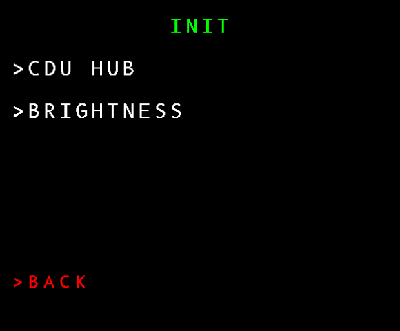
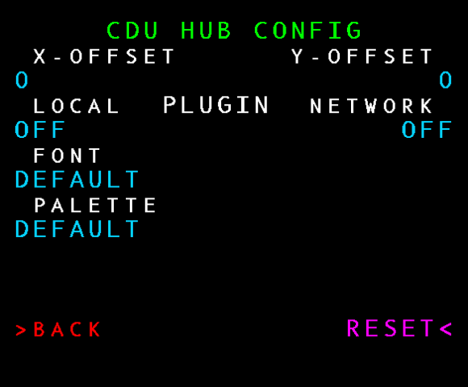
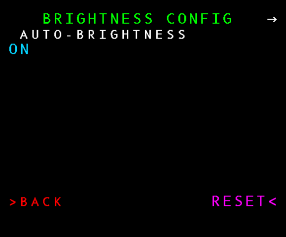
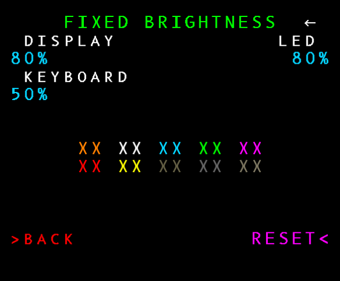
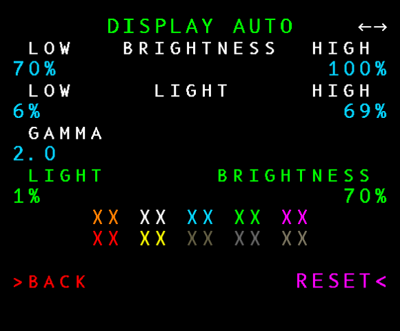
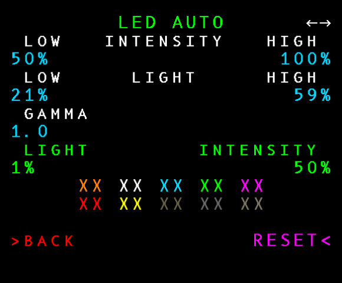
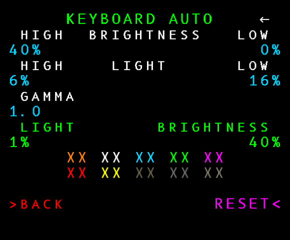

# CDU HUB Built-In Pages

Click [here to return to the menu readme](menu.md).

## INIT

This is available from most pages by pressing `INIT` or `INIT REF`.

### CDU-HUB CONFIGURATION

Basic CDU-HUB configuration.

The X- and Y- offsets shift the top-left corner of the image.

The PLUGIN options control whether the program loads plugins at
startup. If you change these options then you will need to
restart the hub before it will take notice of them.

LOCAL PLUGINs are in-process .NET DLLs that target .NET Standard
2.0 and are installed under the `<working folder>\Plugins` folder.

REMOTE PLUGINS are not yet implemented, but the intention is that
they are declared by JSON manifest files under `<working folder\Plugins>`
and then the hub will act as an MQTT broker to accept display
output from, and send keyboard input to, local or networked MQTT
clients.

Pressing left LSB 3 cycles through all of the built-in and
custom fonts. This changes the default font that each page uses.
Some pages (E.G. flight simulator pages) have their own font
customisation.

TODO: Document how to add custom fonts.

Pressing left LSB 4 cycles through all of the build-in and
custom palettes. This changes the default palette that each page
uses. Some pages (E.G. flight simulator pages) have their own
palette customisation.

TODO: Document how to add custom palettes.

### BRIGHTNESS CONFIGURATION

The CDU Hub relies upon the use of two "interrupt" buttons that
can be used to trigger behaviour on the flight simulator and
passthrough pages.

The Airbus MCDU has two blank buttons that can be used for this
purpose. However, the Boeing PFP does not. The best candidates
for the two interrupt buttons are the `-BRT+` buttons.

For that reason on both CDUs the brightness buttons are used as
interrupts.

Controlling the brightness of the display, keyboard backlight
and LEDs is done through this menu instead of via the hardware
buttons.

On the first page you can choose between automatic brightness
levels or fixed brightness levels.

Pressing the `RIGHT ARROW` or `NEXT PAGE` button takes you to the first
configuration page for either fixed or automatic brightness
settings.

#### FIXED BRIGHTNESS CONFIGURATION

Fixed brightness settings only have one page of settings.

Note that if you set the display or LED brightness levels to
zero then you won't be able to see them, so the hub limits the
lower levels of those to 5%.

The XX colour swatches are there to help you gauge whether the
display is bright enough to see all of the colours. All of the
LEDs are lit for the same reason.

#### AUTOMATIC BRIGHTNESS CONFIGURATION

Auto-brightness uses the device's ambient light settings to
adjust the display, LED and keyboard brightnesses to match the
environment.

There are three configuration screens when using automatic
brightness.

##### DISPLAY

The BRIGHTNESS settings set a range of brightnesses. The LOW
value is used when ambient light is below the LOW LIGHT level.
The HIGH value is used when ambient light at above the HIGH
level.

When the ambient light is between the LOW and HIGH light levels
the brightness is calculated on a scale between the LOW and
HIGH brightness levels. The GAMMA factor adjusts the shape of
the curve used to calculate the scale - the higher the gamma,
the quicker the value tends towards the midpoint between LOW
and HIGH.

The green LIGHT value is the current value from the device's
ambient light sensors, and the green BRIGHTNESS value is the
brightness calculated using the settings.

Pressing `NEXT PAGE` or `RIGHT ARROW` takes you to the 
automatic brightness configuration page for the LED backlight.

##### LED

See the DISPLAY configuration above - works the same way except
this configures the LED intensity instead of the display
brightness.

Pressing `NEXT PAGE` or `RIGHT ARROW` takes you to the final
automatic brightness configuration page, which is for the
keyboard backlight.

##### KEYBOARD

This is similar to the previous screens but it works in
reverse. With backlights you want the brightness to increase
when there is more light falling on the device so that you can
still see them, but the keyboard backlight is only needed when
there isn't much ambient light.

The HIGH BRIGHTNESS value is used when ambient light is below the LOW LIGHT level.
below the HIGH LIGHT level.

The LOW BRIGHTNESS value is used when ambient light is above the
LOW LIGHT level.

