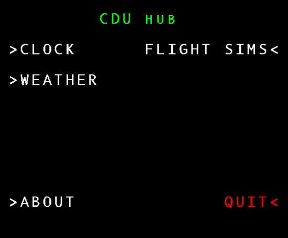
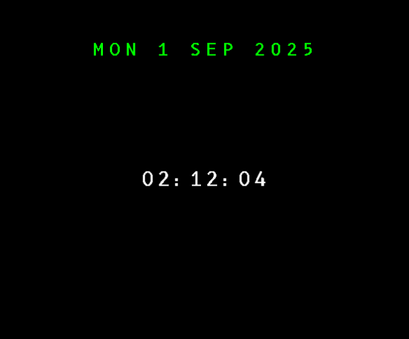
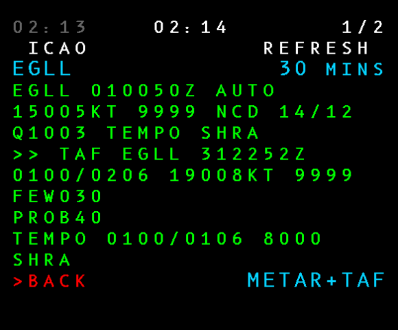
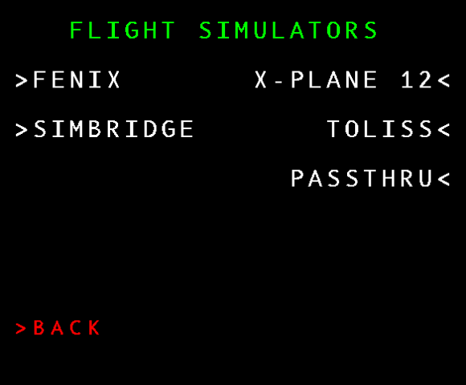
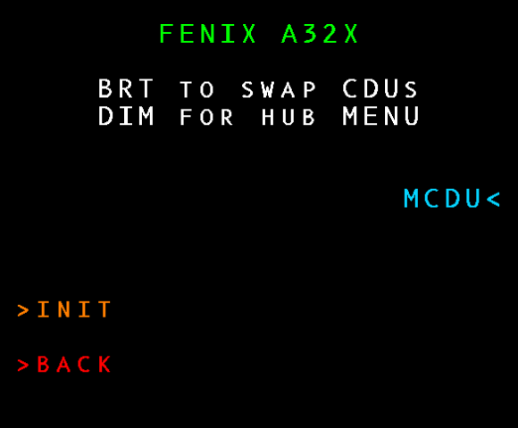
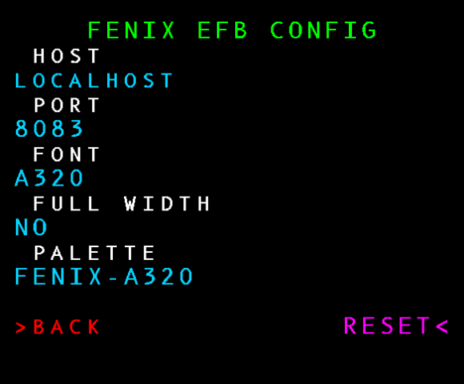
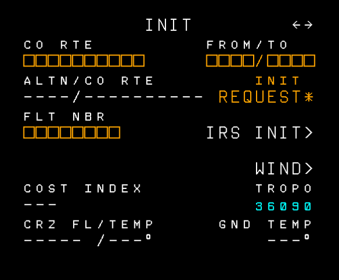

# CDU HUB Built-In Pages

> [!NOTE]
> You'll see `>BACK` in red against the `Left Line Select 6` button
on many pages. It always takes you back to whichever page you
were on previously. Pressing `DIM` or `-BRT` will also take you
back to the previous page.

## ROOT

This is the first screen that is shown when starting the program.

You can return to this page by pressing the `MENU` or `MCDU MENU`
button from almost any page (except pages that are showing the
output from a flight simulator).

Pressing QUIT immediately halts the program.

## INIT

This is available from most pages by pressing `INIT` or `INIT REF`.

Click [here for documentation on the INIT pages](menu-init.md).

## CLOCK

A simple clock page that shows the local date and time. Use the
`MENU` or `MCDU MENU` button to leave the page.

## WEATHER

There's only one entry in here at the moment, it takes you
to the METAR/TAF page.

### METAR/TAF

This page periodically looks up METAR and TAF reports from
https://aviationweather.gov.

The left/right arrow or next/prev page keys will cycle through
pages. The `Right LSB 6` button cycles between showing METAR + TAF,
METAR or TAF. The program remembers which station you last
fetched.

The refresh can be turned off by setting a refresh interval of
zero minutes.

## FLIGHT SIMULATORS

These are the flight simulators that CDU Hub supports.

All of them, with the exception of the `PASSTHRU` page, follow
the same pattern. The examples use the Fenix pages, but they
are the same for all supported simulators.

### MENU

The menu page tells you what the interrupt keys will do when
you're in the flight simulator.

In all cases `DIM` or `-BRT` will return you to CDU Hub.

The `BRT` or `BRT+` key will cycle between the simulator's CDUs
(for those simulators that support more than one CDU).

The `Left LSB 5` button takes you to the simulator's INIT
page.

The `Right LSB 3` button connects you to the simulator.

### INIT

Here you can configure how CDU Hub will connect to the flight
simulator, and the font and palette that it will use when
rendering the simulator's CDU.

The FULL WIDTH option refers to whether a full-width or
thin version of the font is used. Thin fonts can sometimes look
better, but that comes at the expense of extra blank space to
the left and right of the display.

### CDU

The MCDU page shows the output from the simulator. While in this
page all input goes to the simulator and not CDU Hub, with the
exception of `BRT/DIM` or `-BRT+`.

`DIM` or `-BRT` will return you to CDU Hub.

`BRT` or `BRT+` will swap simulated CDUs (with simulators that
support more than one CDU).

### PASSTHRU

The PASSTHRU flight simulator page does not attempt to connect
to any flight simulators, it just stops CDU Hub from driving
the display or reacting to input. You should be able to use
other programs to drive the device while in this mode.

Pressing `DIM` or `-BRT` comes out of passthrough and returns
you to CDU Hub.

Note that if you return to CDU Hub while another program is
also trying to send output to the USB device, or while another
program is responding to input from the USB device, then things
will get freaky.

Ensure that the other program is not trying to drive the device
before leaving passthrough mode.
