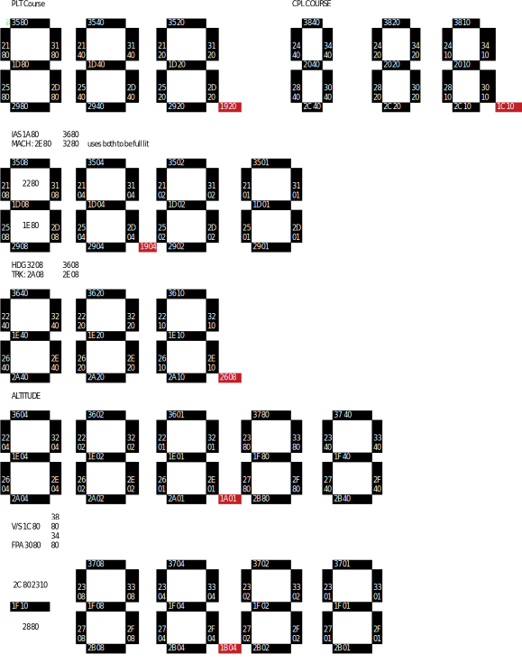

# WinWing PAP-3 Primary Autopilot Panel USB Notes

These notes describe the current reverse-engineered HID protocol implementation for the
WinWing PAP-3 Primary Autopilot Panel.

The implementation lives in:
- `Pap3Device` (HID transport + encode/decode)
- `Pap3State` (display state model)
- `Pap3Leds` (LED state model)
- `ControlMap` / `Control` (input report mapping)


## USB Vendor and Product IDs

The WinWing vendor ID is `0x4098`.

| Configuration                | Product ID |
| ---                          | --- |
| PAP3                         | 0xBF0F |
| PAP3 + 3N PCD                | ?? |
| PAP3 + 3M PCD                | ?? |
| PAP3 + 3N PCD + 3M PCD       | ?? |


## Command Prefixes

The PAP-3 uses different prefixes for the display payload and for LED / brightness commands:

| Purpose | Prefix | Notes |
| --- | --- | --- |
| Display | `0FBF` | Used in `F0` display packets (`0x38` command) |
| LEDs / Brightness | `0100` | Used in 14-byte `0x02` packets |


## Backlights, Brightness and LEDs

Backlights and LEDs are set via a `0x02` packet of 14 bytes.
General form:

```
00 0102 03 04 05 06 0708 09 0a 0b 0c 0d
---------------------------------------
02 01 00 00 00 03 49 {TT} {VV} 00 00 00 00 00
```

Where:
- `{TT}` is the variable type
- `{VV}` is the desired value

### Brightness variable types

| Type (`{TT}`) | Sets | Range |
| --- | --- | --- |
| `00` | Panel backlight | `00`..`FF` |
| `01` | Digital tube / display backlight | `00`..`FF` |
| `02` | Marker light (button LEDs) | `00`..`FF` |

### LED on/off variable types

LEDs are toggled with type codes (value is `00` off, `01` on). The mapping is implemented in `Pap3Device.BuildLedCommands()`.


## LCD Segment Displays

All segment displays are controlled via a 64-byte `0xF0` output report.

The PAP-3 display update is sent as a 4-packet sequence (see `Pap3Device.BuildPap3DisplayCommands()`):

I suspect these to be "init" packets ( did not try without them ). 
I send them once at the start of the program
Capture showed 3 packets of full zeros before the actual display data packet, but i send one and it seems to work

```
00 01 .. .. .. .. 3f
--------------------
f0 02 <all zeros> 00
```

Don't know the meaning of {03} and {02} 
These are mandatory for the display to work. I tried without the 2 38 full zeros packets and the display did not work.
I suspect they will correspond the two other units of the PAP3 ( PDC 3N and PDC 3M )

```
00  0102  03 0405 06 07  08  09 0a 0b 0c 0d 0e 0f 10  11 12 13 14 15 16 17 18 19 .. .. .. .. .. 38 39 3a 3b 3c 3d 3e 3f
-----------------------------------------------------------------------------------------------------------------------
f0 {SQ}   38 {ID} 00 00 {02} [01 00 00 c3 29 20 00 00] b0 00 00 00 00 00 00 00 [LCD mapping datas ] < zero padding >
f0 {SQ+1} 38 < all zero >
f0 {SQ+2} 38 < all zero >

00  0102  03 04 05 06 07 08 09 0a 0b 0c 0d 0e 0f 10 11 12 13 14 15 16 17 18 19 1a 1b 1c 1d1e 1f 20  21  22 23 24 25 26 27 28   29 ....... 3f
----------------------------------------------------------------------------------------------------------------------------------------
f0 {SQ+3} 2a 00 00 00 00 00 00 00 00 00 00 00 00 00 00 00 00 00 00 00 00 00 00 00 00 00 {ID} 00 00 {03} [01 00 00 c3 29 20 00] < all zeros >
```

The display payload bytes that drive segments are primarily in the range `0x19..0x38`.
The encoder clears this region each update to avoid stale segments (see `EncodePap3Displays()`).

### Digit encoding model

The PAP-3 uses a multiplexed, non-standard layout:
- Each segment position is an offset in the payload.
- Each digit within a display window is a bitmask (e.g. `0x80`, `0x40`, ...), meaning multiple digits share the same segment byte.

`Pap3Device` uses `DigitMapping[]` tables to describe:
- which bitmask represents a digit
- which offsets correspond to the 7 segments (G,F,E,D,C,B,A)


```
   G
 B   F
   A
 C   E
   D 
```
The base 7-seg values are in `_DigitValues`.



When you have 2 values around an indicator, it means that the indicator is lit by 2 leds ! 
( very noticeable on the MACH indicator if you only lit one )

This mapping is made in these `DigitMapping` arrays:

```        
// PLT Course - 3 digits
    static readonly DigitMapping[] _PltCourseMapping = new DigitMapping[]
    {
        new DigitMapping { BitMask = 0x80, SegmentOffsets = new int[] { 0x1D, 0x21, 0x25, 0x29, 0x2D, 0x31, 0x35 } }, // Hundreds
        new DigitMapping { BitMask = 0x40, SegmentOffsets = new int[] { 0x1D, 0x21, 0x25, 0x29, 0x2D, 0x31, 0x35 } }, // Tens
        new DigitMapping { BitMask = 0x20, SegmentOffsets = new int[] { 0x1D, 0x21, 0x25, 0x29, 0x2D, 0x31, 0x35 } }  // Ones
    };
```
Decimal points and indicator are modified directly in the payload bytes when needed. 


## Keys / Input reports

The device sends a stream of `0x01` input reports (25 bytes).

`Pap3Device.ProcessReport()` compares successive reports and raises:
- `ControlActivated`
- `ControlDeactivated`

The mapping between bits and controls is defined in `ControlMap.InputReport01FlagAndOffset()`.

(See `ControlMap.cs` for the authoritative table.)


## Samples

- `library/samples/pap3-leds` demonstrates LEDs, brightness, and display test patterns.


## TODO

- Change the state model to accept "strings" instead of int for the displays instead of individual digits. ( could display letters like FL on the altitude )
- Isolate common parts of Pap3Device and FCU into a base WinWing panel class
- Add support for additional WinWing panels (e.g. PDC 3N / 3M) when available.


